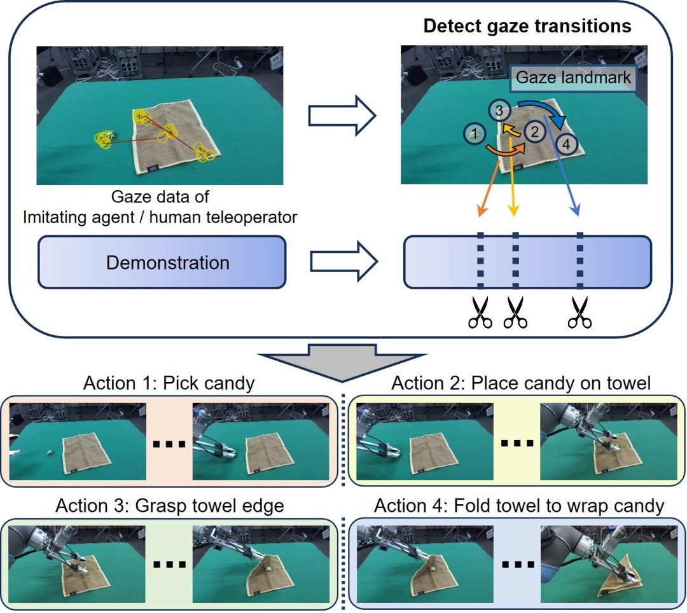
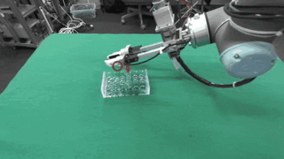

# Gaze-Guided Task Decomposition for Imitation Learning in Robotic Manipulation
#### Intelligent Systems and Informatics Laboratory, The University of Tokyo

[Ryo Takizawa](https://crumbyrobotics.github.io), Yoshiyuki Ohmura, Yasuo Kuniyoshi


[ [<u>arxiv</u>](https://arxiv.org/abs/2501.15071) ] [ [<u>Paper</u>](https://arxiv.org/pdf/2501.15071) ]

Gaze plays a critical role in human object manipulation, where it is strongly correlated with hand movements. We hypothesize that an imitating agent’s gaze control—fixating on specific landmarks and transitioning between them—simultaneously segments demonstrated manipulations into sub-tasks. 

we propose a simple yet robust task decomposition method based on gaze transitions. The method leverages teleoperation, a common modality in robotic manipulation for collecting demonstrations, in which a human operator’s gaze is measured and used for task decomposition as a substitute for an imitating agent’s gaze. Notably, our method achieves consistent task decomposition across all demonstrations for each task, which is desirable in contexts such as machine learning. 

<p align="center">
  
</p>


## Installation
The default is set to PyTorch 2.3.0, but this has no particular significance. Please change it to an appropriate PyTorch version as needed, such as in response to NVIDIA driver issues.

<u>conda</u>:
```
conda env create -f conda.yaml
conda activate taskdecomp
```

<u>pip</u>:
```
pip install -r requirements.txt
```

## Example Demonstration
An example demonstration dataset can be donwloaded from [<u>here</u>](https://drive.google.com/file/d/1dmOHCXq7CvSoY1mEq0ISvKxJA_kmQQkG/view?usp=sharing).

It contains three H5DF (.h5) files. After moving them to the dataset directory, you can test our algorithm using **task_decomp.ipynb**.
```
GazeTaskDecomp/
 ├── dataset/
 │   ├── example_demo1.h5
 │   ├── example_demo2.h5
 │   ├── example_demo3.h5
 │   ├── gifs/
 │
 ├── task_decomp.ipynb
```

## Teleoperator's Gaze Behavior in Tasks
<p align="center">
  
  <br>WrapCandy
</p>
<p align="center">
  
  <br>MoveFlask
</p>
<p align="center">
  
  <br>OpenCap
</p>

## Citation
```
@article{Takizawa2025,
  title={Gaze-Guided Task Decomposition for Imitation Learning in Robotic Manipulation},
  author={Ryo Takizawa, Yoshiyuki Ohmura, Yasuo Kuniyoshi},
  journal={Arxiv},
  volume={abs/2501.15071},
  year={2025}
}
```